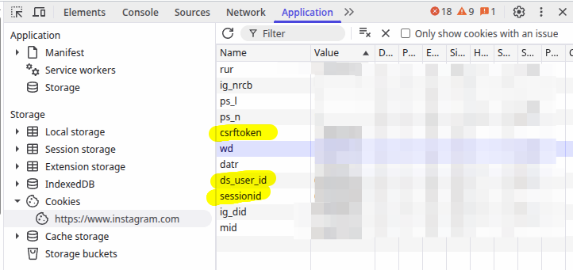
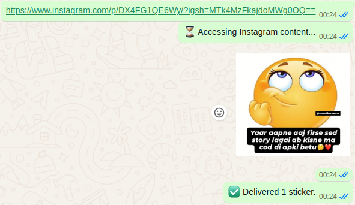

# The Stickerist

[](https://nodejs.org) [](LICENSE)

> Personal WhatsApp bot that automatically converts Instagram post images and carousels into high-quality WhatsApp stickers.

## Features

- **Instagram Scraping**: Automatically downloads images from Instagram post URLs, including full carousel support.
- **Sticker Conversion**: Converts images to optimized `.webp` stickers using Sharp.
- **Auto-Optimization**: Iteratively adjusts image quality to ensure stickers stay under WhatsApp's 100KB limit.
- **Headless Operation**: Uses Puppeteer-core to scrape images without a visible browser window.
- **Session Persistence**: Maintains WhatsApp authentication across restarts using multi-file auth state.
- **Zombie Cleanup**: Automatically kills stale browser processes on startup to save system resources.

## Prerequisites

- **Node.js** >= 18.x
- **Chromium-based Browser**: Chrome, Brave, Chromium, or Microsoft Edge installed on the system.
- **Instagram Cookies**: (recommended) A `cookies.txt` file containing your Instagram login cookies to avoid rate limits or login walls.

## Installation

1. Clone the repository:
   ```bash
   git clone https://github.com/aryankushwaha81780/The-Stickerist
   cd the-stickerist
   ```

2. Install dependencies:
   ```bash
   npm install
   ```
3. and if the error says **"'git' is not recognized"**. why are you even on this platform...


## Configuration

### Environment Variables
The bot can be configured using environment variables. For example, to specify a custom browser path, you can set it in your terminal before running the bot:

```bash
# for Linux/MacOS
which brave-browser # returns the path of browser (let path_unix)
# (Other examples: which google-chrome, which firefox, which safari)
export BROWSER_PATH= <path_unix>

# OR

# for Windows
where brave.exe # returns the path of browser (let path_windows)
# (Other examples: where chrome.exe, where firefox.exe, where msedge.exe)
set BROWSER_PATH= <path_windows>
```

Note for Windows PowerShell users: If you are using PowerShell rather than the Command Prompt, use:
```PowerShell
(Get-Command brave.exe).Source
```

### Instagram Cookies
To enable authenticated scraping (highly recommended to avoid "Login required" blocks), follow these exact steps:

1. **Initialize File**: Copy the example cookie file to create your active cookie file:
   ```bash
   cp cookies-example.txt cookies.txt
   ```

2. **Retrieve Cookies**:
   - Open [Instagram.com](https://www.instagram.com) and log in.
   - Open Developer Tools (`F12`).

         
   - Navigate to the **Application** tab (as seen in the screenshot above).
   - In the left sidebar, under **Storage**, expand **Cookies** and select `https://www.instagram.com`.
   - You will see a list of cookies (e.g., `sessionid`, `mid`, `ds_user_id`).
   - just double-tap the values in-front of them and copy them.
   - Open `cookies.txt` and replace its contents with the cookie string you just copied. Save the file.

## Usage

1. Start the bot:
   ```bash
   npm start
   ```

2. **Link WhatsApp**: On first run, a QR code will appear in your terminal. Scan it using **WhatsApp > Linked Devices > Link a Device**.

3. **Convert Stickers**: Send any Instagram post URL (e.g., `https://www.instagram.com/p/XXXXXXXXXXX/`) to your own chat(your own number). The bot will download the images, convert them, and send them back as stickers.


4. **troubleshoot**: if there is an error that prompts you to remove auth/ then run the following command before starting the bot again:
    ```bash
    rm -rf auth
    ```

## Output
   

## Contributing
Pull requests are welcome. For major changes, please open an issue first to discuss what you would like to change.
This is my own thing that i needed for a long time so if you think how can someone make something this stupid, then just so you know, **IDGAF**. Thank you!! ;)

## License
MIT © [aryan kushwaha](https://github.com/aryankushwaha81780)